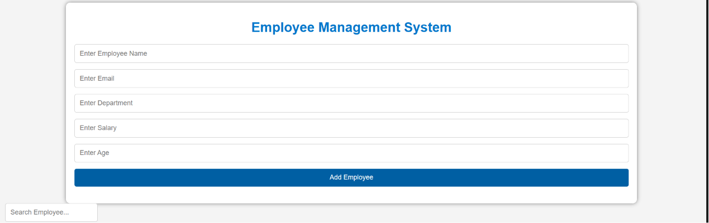
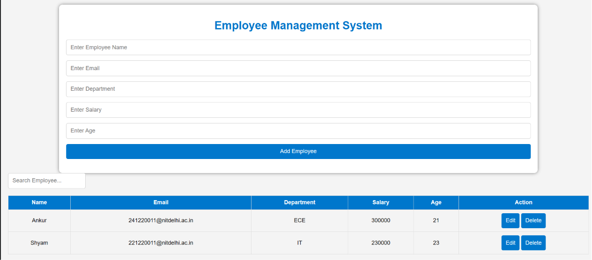
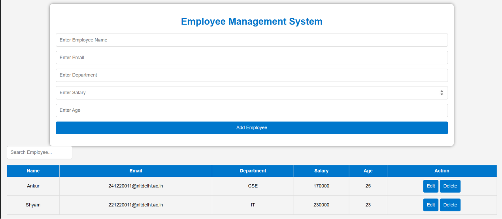
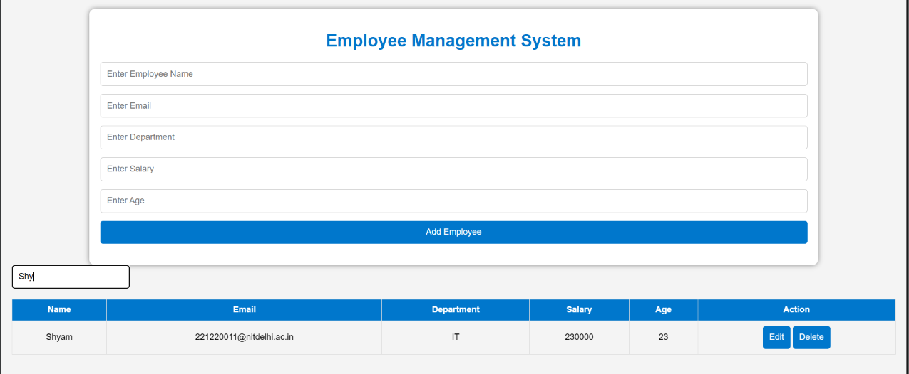
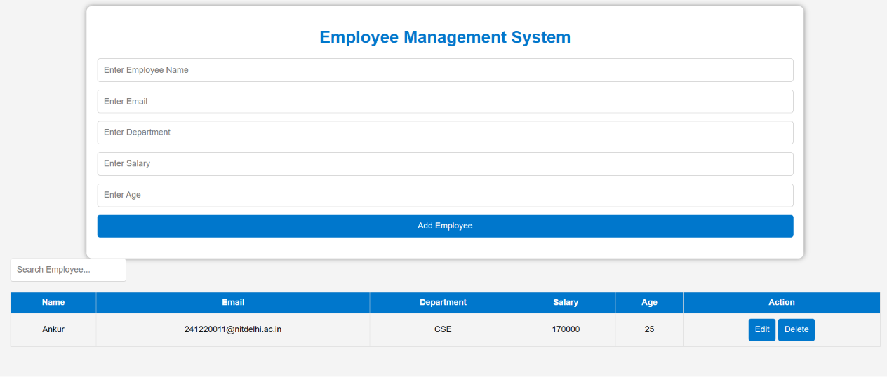

# Employee Management System

A responsive Employee Management System built using HTML, CSS, and JavaScript.

## Features

- Add Employee
- Edit Employee
- Delete Employee
- Search Employee
- Local Storage Support

## Technologies Used

- HTML5
- CSS3
- JavaScript

## How to Run

1. Download or clone this repository.
2. Open `index.html` in your browser.

## Project Features

- Create, Read, Update, Delete (CRUD)
- Search Employees
- Persistent Storage using Local Storage

## Screenshots

### Home Page

### Add Employee

### Edit Employee

### Search Employee

### Delete Employee

